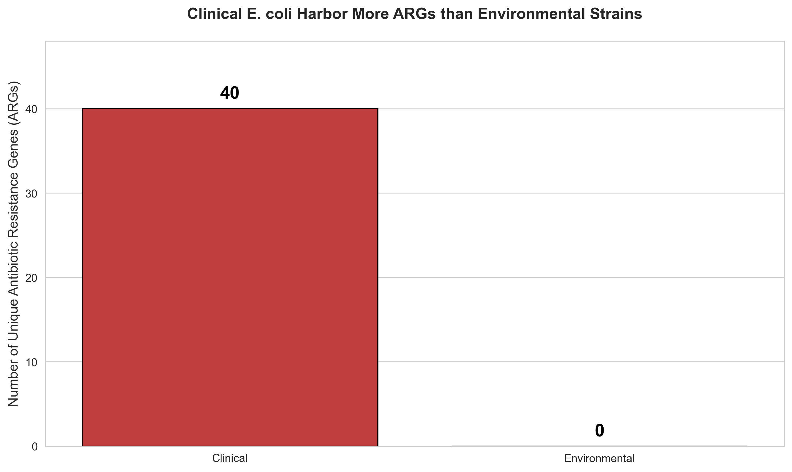

# E. coli Antibiotic Resistance Analysis  
**Clinical vs Environmental Strains**



> **Key Finding**: Clinical *E. coli* (SRR9694420) harbors **40 unique antibiotic resistance genes (ARGs)** — environmental strain (SRR390728) has **0**.

---

## Project Overview
Comparative genomics pipeline to detect and compare ARGs in two *E. coli* strains:
- **Clinical**: Hospital isolate (multidrug-resistant)
- **Environmental**: Soil/water isolate (antibiotic-free)

---

## Methods
| Step | Tool |
|------|------|
| Raw data | NCBI SRA |
| Quality trim | Fastp |
| Assembly | SPAdes |
| ARG detection | ABRicate + CARD database |
| Analysis | Python (pandas, seaborn) |

---

## Results
- **Clinical**: 46 ARG hits → **40 unique genes**
- **Environmental**: 0 ARGs
- **Conclusion**: Hospitals drive extreme multidrug resistance

[Download Full Report (PDF)](results/ARG_Report.pdf)

---

## Reproducibility
```bash
# 1. Clone repo
git clone https://github.com/[yourusername]/ecoli-arg-analysis.git
cd ecoli-arg-analysis

# 2. Set up environment
conda env create -f environment.yml
conda activate ecoli_arg

# 3. Run analysis
jupyter lab ARG_Comparison.ipynb
